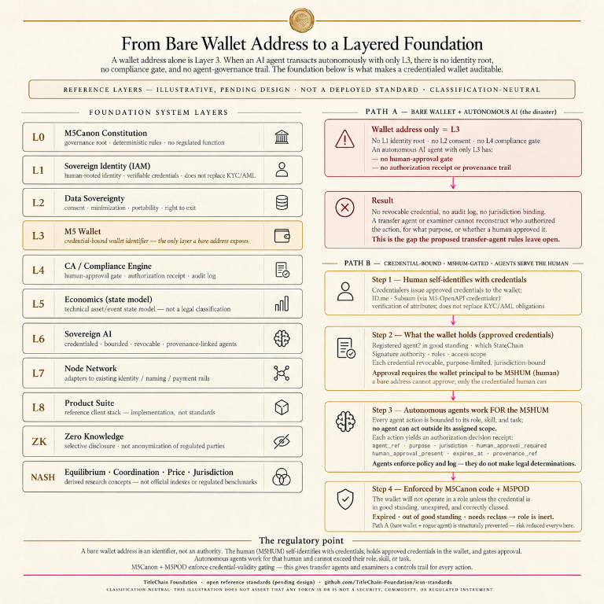
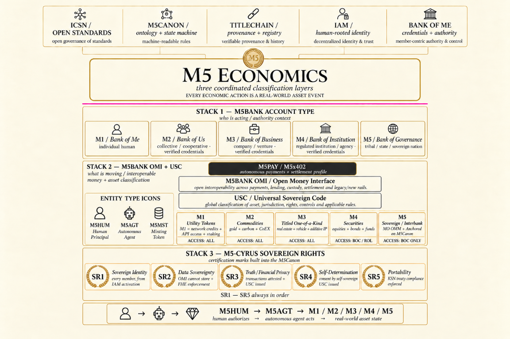

# Featured Public-Review Visuals

> **Status: Illustrative Public Review Drafts.** These diagrams help participants enter the discussion. They are not adopted standards, regulatory classifications, production architecture, credentials, certifications, or evidence of deployment.

The maintained repository text, schemas, RFCs, and governance records control wherever a diagram uses simplified or earlier terminology. Participants are encouraged to identify inconsistencies, accessibility issues, missing evidence, and proposed corrections in the linked public-review threads.

## M5 wallet layer stack

The left side presents illustrative layers from M5Canon governance through identity, data sovereignty, wallet, compliance, economic state, bounded AI, networks, product implementation, zero knowledge, and economic research. The right side contrasts a bare wallet and autonomous agent without verifiable authority against a credential-bound, human-gated path with revocable credentials, scoped agents, authorization receipts, and M5Canon/M5POD enforcement.

Review this visual through [Issue 57 — credential-bound participant identifiers](https://github.com/TitleChain-Foundation/icsn-standards/issues/57) and [Issue 60 — pre-activation controls for automated agents](https://github.com/TitleChain-Foundation/icsn-standards/issues/60).

## M5 economic stack

The diagram separates account and authority context, an illustrative economic and asset-classification layer, the M5-Cyrus rights framework, and the path from a human principal through a bounded agent to an asset-state event.

This visual contains condensed labels that must be read with the maintained [economic architecture](../../wiki-source/M5-Economic-Architecture-and-Roadmap.md). In particular, the current canonical public text defines M1 as Money + Utility, M2 as Commodities, M3 as Titled / Unique / Collectible RWA, M4 as Financial Wrapper, and M5 as Jurisdictional Security-State Profile. External legal classifications remain separate authoritative mappings.

Review this visual through [Issue 62 — reference state model for the underlying right](https://github.com/TitleChain-Foundation/icsn-standards/issues/62).

## M5POD stack

The diagram places ICSN open standards, M5Canon, TitleChain provenance, human-rooted IAM, and Bank of Me authority above the private M5POD boundary. It then shows an offline-capable private agent, encrypted networking, cross-platform M5Shell, M5 applications, the M5 Canon Graph, and a sovereign threat-analysis surface.

Review the maintained [M5POD member activation architecture](../../docs/M5POD-MEMBER-ACTIVATION-ARCHITECTURE.md), [system-diagram description](../../architecture/M5POD-MEMBER-ACTIVATION-ALT-TEXT.md), and [public/private boundary](../../M5ECOSYSTEM-APPROVAL-BOUNDARY.md).

## Join the public commons review

- [Choose a provider, data, product, workforce, training, or assurance contribution track](../../COMMONS-CONTRIBUTION-TRACKS.md).
- [Introduce a commons proposal in Discussion 22](https://github.com/orgs/TitleChain-Foundation/discussions/22).
- [Introduce yourself or ask a cross-cutting question in Foundation Discussion 19](https://github.com/orgs/TitleChain-Foundation/discussions/19).
- [Track the seven SEC transfer-agent review topics](https://github.com/TitleChain-Foundation/icsn-standards/milestone/2).
- [Choose a contribution by skill](../../CONTRIBUTOR-PATHWAYS.md).

The public goal is interoperable infrastructure that can support a digital-asset edge economy and privacy-preserving, provenance-aware economic indicators and methodologies. Participation is an invitation to review and build the public commons; it does not imply that any proposed index is an official statistic, regulated benchmark, deployed service, or adopted standard.
