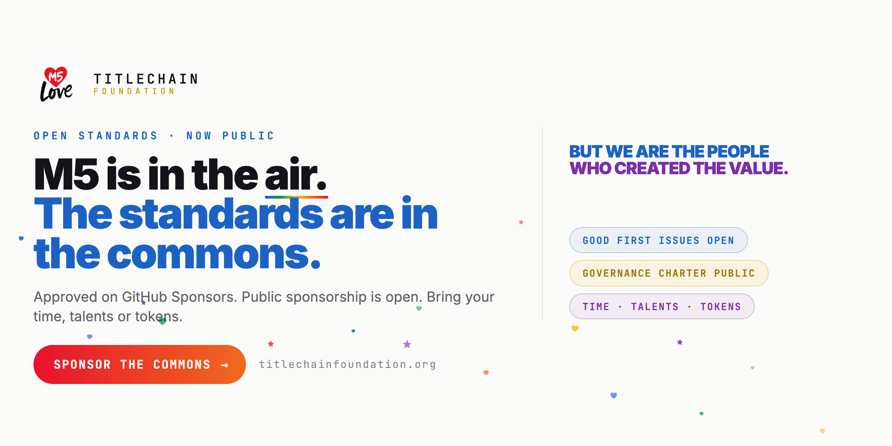
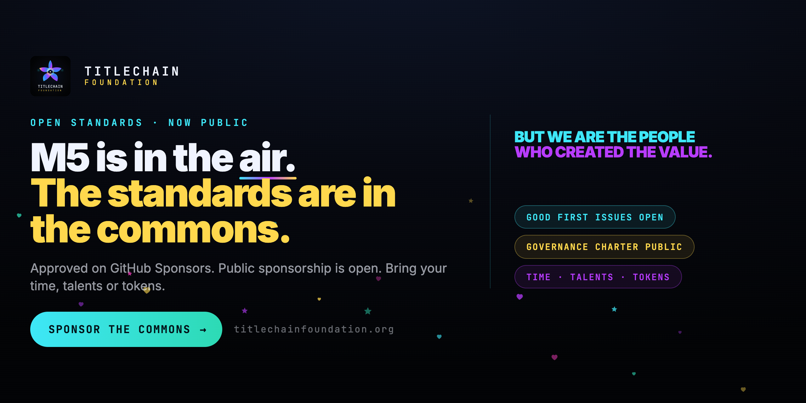
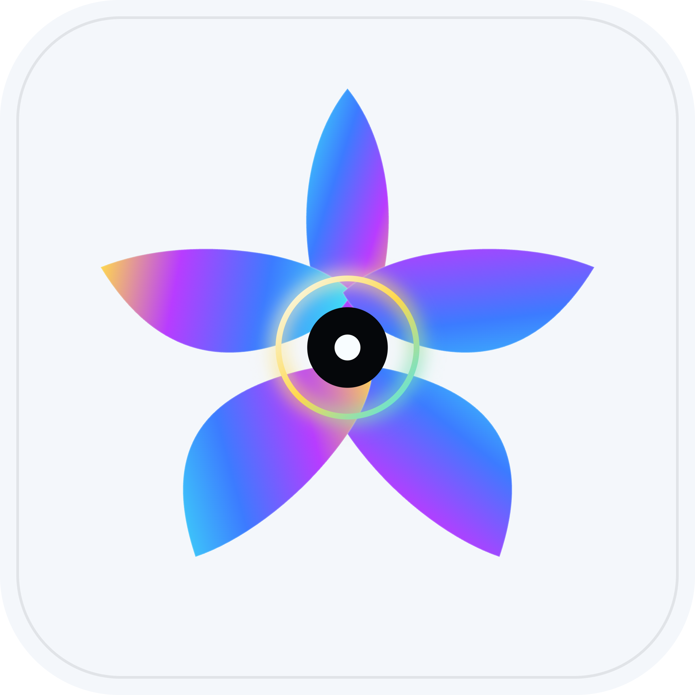

# TitleChain Foundation Social Share Kit

Use these campaign assets and sample posts to share the Foundation's public standards work, contribution pathways, and GitHub Sponsors page.

## Social cards

### Bright card

[Download the bright 1280 x 640 PNG](assets/github-sponsor-card-light.png) for email, LinkedIn, and light-background social feeds.

### Dark card

[Download the dark 1280 x 640 PNG](assets/github-sponsor-card-dark.png) for GitHub and dark-background social feeds.

## Foundation avatars

| Asset | Preview | Suggested use |
| --- | --- | --- |
| [Dark-background glyph](assets/titlechain-avatar-glyph.png) |  | Square profile image on dark surfaces |
| [Light-background glyph](assets/titlechain-avatar-light.png) |  | Square profile image on light surfaces |

## Copy-ready posts

### Public standards

> M5 is in the air. The standards are in the commons. Explore TitleChain Foundation's public specifications, governance, and contribution pathways: https://github.com/TitleChain-Foundation/icsn-standards

### Contribute by skill

> Security, privacy, identity, architecture, legal, accessibility, education, and documentation reviewers can choose scoped TitleChain Foundation work by skill: https://github.com/TitleChain-Foundation/icsn-standards/blob/main/CONTRIBUTOR-PATHWAYS.md

### Sponsor the commons

> Help fund open specifications, security review, conformance work, and public infrastructure through TitleChain Foundation on GitHub Sponsors: https://github.com/sponsors/TitleChain-Foundation

## Sharing notes

- Link to the public repository or Sponsors page so people can verify the source and current status.
- Keep Foundation standards participation separate from private M5Ecosystem access, production services, credentials, cohort participation, and investment.
- Do not imply that sharing, sponsorship, or public participation grants governance authority, conformance status, Foundation membership, or access to private systems.
- Do not add private identity data, contact details, credentials, wallet information, private keys, or confidential business information to public posts.

For the full campaign announcement, read the [Foundation Sponsors newsletter](NEWSLETTER.md).