# Public Reference Artifacts

This page is the direct index for the public artifacts referenced by the TitleChain Foundation comment on SEC File No. S7-2026-30.

## Start here

The artifacts below are separate, evolving materials that participants may review and improve through the Foundation's public process.

| Label | Meaning |
|---|---|
| **Public Review** | Draft material open for evidence, objections, implementation analysis, and proposed revisions. It has not been adopted as a Stable standard. |
| **Draft RFC** | A proposal moving through the RFC process. Publication does not imply acceptance. |
| **Published** | A current repository statement or boundary document. It does not certify an implementation or confer authority. |
| **Filed record** | The immutable document submitted to the SEC. Repository discussion does not modify the filed record or count as an SEC comment. |

## Visual overview

This **Public Review Draft** diagram provides a broad system context for several artifacts below. It is not an exhibit to the SEC filing and does not represent deployment, certification, regulatory approval, or production readiness. Review the [accessible description](../architecture/M5POD-MEMBER-ACTIVATION-ALT-TEXT.md), [maintained Mermaid source](../architecture/m5-sovereign-stack.mmd), or alternate [PNG](../architecture/rendered/m5-sovereign-stack.png) and [PDF](../architecture/rendered/m5-sovereign-stack.pdf) formats.

## Appendix B — Public artifacts referenced

The following are public Draft artifacts in the ICSN standards repository. Each is under public review and is cited as an example of a reviewable, interoperable reference artifact — not as an adopted standard or a mandated design. Inclusion here does not represent that any artifact is deployed, credentialed, or authorized for production use.

| Artifact | Type | Status | Relevance |
|---|---|---|---|
| [Transfer-Agent Digital-Asset Reference Architecture](TRANSFER-AGENT-DIGITAL-ASSET-REFERENCE-ARCHITECTURE.md) | Reference architecture | Public review | End-to-end transfer-agent authority, title, and evidence flow |
| [M5IAM → M5HUM Human Authority Architecture](M5IAM-M5HUM-AUTHORITY-ARCHITECTURE.md) | Reference architecture | Public review | Accountable principal and identity root |
| [M5Canon Six-Gate Authority and Transfer Control](M5CANON-SIX-GATE-AUTHORITY-AND-TRANSFER-CONTROL.md) | Control model | Public review | Pre-activation agent and transfer controls |
| [M5MST Asset Minting and TitleChain Registration](M5MST-ASSET-MINTING-AND-TITLECHAIN-REGISTRATION.md) | Reference architecture | Public review | Separates minting and origination authority from transfer rights |
| [Credentialed Authority Registry](CREDENTIALED-AUTHORITY-REGISTRY.md) and [JSON Schema](../schemas/credentialed-authority-registry.schema.json) | Reference model and JSON Schema | Public review | Current role, appointment, standing, delegation, and revocation |
| [M5-CV Capability Profile JSON Schema](../schemas/m5-cv-capability-profile.schema.json) | JSON Schema | Public review | Holder-controlled capability evidence; not identity or authority by itself |
| [M5 Consent Event JSON Schema](../schemas/m5-consent-event.schema.json) | JSON Schema | Public review | Permission and restriction lifecycle |
| [M5 Authorization Decision Receipt JSON Schema](../schemas/m5-authorization-decision-receipt.schema.json) | JSON Schema | Public review | Per-action principal, agent, purpose, jurisdiction, approval, and evidence receipt |
| [M5AGT Credentialed Operations](../M5AGENT_OPERATIONS.md) | Operating policy | Public review | Bounded delegated machine authority |
| [RFC 0001 — Hardware Onboarding Standard](../rfcs/0001-hardware-onboarding-standard.md) | Draft RFC | Draft | Illustrative title-rights and provenance record lifecycle |
| [M5Ecosystem Approval Boundary](../M5ECOSYSTEM-APPROVAL-BOUNDARY.md) | Boundary statement | Published | Separates the public commons from restricted or production implementations |

## Review by recommendation

### Voluntary open standards

- [Transfer-Agent Digital-Asset Reference Architecture](TRANSFER-AGENT-DIGITAL-ASSET-REFERENCE-ARCHITECTURE.md)
- [Open-standards alignment](../regulatory/sec/s7-2026-30/OPEN-STANDARDS-ALIGNMENT.md)
- [RFC index](../rfcs/README.md)

### Credential-bound participant identifiers

- [M5IAM → M5HUM Human Authority Architecture](M5IAM-M5HUM-AUTHORITY-ARCHITECTURE.md)
- [Credentialed Authority Registry](CREDENTIALED-AUTHORITY-REGISTRY.md)
- [Credentialed Authority Registry JSON Schema](../schemas/credentialed-authority-registry.schema.json)
- [M5-CV Capability Profile JSON Schema](../schemas/m5-cv-capability-profile.schema.json)

### Technology-neutral Forms TA-1 and TA-2 disclosures

- [Transfer-Agent Digital-Asset Reference Architecture](TRANSFER-AGENT-DIGITAL-ASSET-REFERENCE-ARCHITECTURE.md)
- [Credentialed Authority Registry](CREDENTIALED-AUTHORITY-REGISTRY.md)
- [M5AGT Credentialed Operations](../M5AGENT_OPERATIONS.md)

### Machine-readable legends and transfer rights

- [Transfer-Agent Digital-Asset Reference Architecture](TRANSFER-AGENT-DIGITAL-ASSET-REFERENCE-ARCHITECTURE.md)
- [M5Canon Six-Gate Authority and Transfer Control](M5CANON-SIX-GATE-AUTHORITY-AND-TRANSFER-CONTROL.md)
- [M5 Consent Event JSON Schema](../schemas/m5-consent-event.schema.json)

### Pre-activation controls for automated agents

- [M5Canon Six-Gate Authority and Transfer Control](M5CANON-SIX-GATE-AUTHORITY-AND-TRANSFER-CONTROL.md)
- [M5AGT Credentialed Operations](../M5AGENT_OPERATIONS.md)
- [M5 Authorization Decision Receipt JSON Schema](../schemas/m5-authorization-decision-receipt.schema.json)

### Origination and transfer authority

- [M5MST Asset Minting and TitleChain Registration](M5MST-ASSET-MINTING-AND-TITLECHAIN-REGISTRATION.md)
- [Transfer-Agent Digital-Asset Reference Architecture](TRANSFER-AGENT-DIGITAL-ASSET-REFERENCE-ARCHITECTURE.md)
- [M5 Consent Event JSON Schema](../schemas/m5-consent-event.schema.json)

### Reference state model for the underlying right

- [Transfer-Agent Digital-Asset Reference Architecture](TRANSFER-AGENT-DIGITAL-ASSET-REFERENCE-ARCHITECTURE.md)
- [RFC 0001 — Hardware Onboarding Standard](../rfcs/0001-hardware-onboarding-standard.md)
- [M5Ecosystem Approval Boundary](../M5ECOSYSTEM-APPROVAL-BOUNDARY.md)

## Public review

Track the complete review and its progress in the [SEC Transfer Agent Rules — S7-2026-30 Public Review milestone](https://github.com/TitleChain-Foundation/icsn-standards/milestone/2).

Choose the narrowest suitable channel:

| What you want to do | Where to participate |
|---|---|
| Understand the filing and ask a cross-cutting question | [Foundation Discussion 19 — public artifact directory](https://github.com/orgs/TitleChain-Foundation/discussions/19) |
| Review voluntary open standards | [Issue 56](https://github.com/TitleChain-Foundation/icsn-standards/issues/56) |
| Review credential-bound participant identifiers | [Issue 57](https://github.com/TitleChain-Foundation/icsn-standards/issues/57) |
| Review Forms TA-1 and TA-2 disclosures | [Issue 58](https://github.com/TitleChain-Foundation/icsn-standards/issues/58) |
| Review machine-readable legends and transfer rights | [Issue 59](https://github.com/TitleChain-Foundation/icsn-standards/issues/59) |
| Review automated-agent pre-activation controls | [Issue 60](https://github.com/TitleChain-Foundation/icsn-standards/issues/60) |
| Review origination versus transfer authority | [Issue 61](https://github.com/TitleChain-Foundation/icsn-standards/issues/61) |
| Review the reference state model | [Issue 62](https://github.com/TitleChain-Foundation/icsn-standards/issues/62) |
| Propose a concrete standards-text change | Follow [CONTRIBUTING.md](../CONTRIBUTING.md) and open an RFC pull request |
| Report a vulnerability | Follow the private process in [SECURITY.md](../SECURITY.md) |

Before contributing, read the [public-review process](../regulatory/sec/s7-2026-30/PUBLIC-REVIEW.md), [participant pathway](../PARTICIPATE.md), and [contribution guide](../CONTRIBUTING.md). The Foundation will handle public input through the response lifecycle described in the public-review process.

GitHub participation supports the Foundation public-review process but does not replace comments submitted through the [official SEC comment form](https://www.sec.gov/comments/s7-2026-30/transfer-agent-rules).
