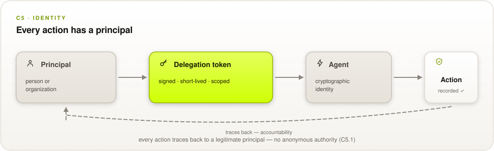

# C5 Identity

## Control Objective

Produce verifiable evidence of actors, agents, and delegated authority relationships. This domain covers agent identity verification, delegation-chain verification, human-to-agent authorization binding, and evidence that every action traces to a legitimate principal.

*Verifiable facts: which agent and which principal ran.*

  <picture>
    <source media="(prefers-color-scheme: dark)" srcset="../../images/diagrams/c5-identity-dark.svg">
    
  </picture>

---

## C5.1 Agent and Principal Binding

Cryptographic principal-to-agent delegation tokens (e.g., short-lived OAuth/JWT, W3C DIDs, or cryptographic capability URLs) explicitly bind agent tool calls back to human intent.

| # | Description | Level |
| :--------: | ------------------------------------------------------------------------------------------------------------------- | :---: |
| **5.1.1** | **Verify that** every execution record carries the agent instance identifier and the principal identifier on whose behalf the action ran, so any sampled action resolves to a named principal. | 1 |
| **5.1.2** | **Verify that** the agent authenticates with a cryptographic credential (certificate, key pair, or DID) validated before actions execute, and that credential-validation events are recorded. | 2 |
| **5.1.3** | **Verify that** each agent tool call carries a delegation token (short-lived OAuth/JWT, W3C verifiable credential, or capability URL) issued by or on behalf of the principal, cryptographically linking the call to the principal's grant. | 2 |
| **5.1.4** | **Verify that** the agent's identity credential is bound to an attested execution environment (key held in the attested enclave or TPM), so the credential cannot be exercised from an environment that fails attestation. | 3 |

**Auditor evidence:** 5.1.1 — sampled records resolved to principals via the identity system. 5.1.2 — credential inventory and validation logs, including one failed validation. 5.1.3 — decode a sampled tool call's token; check issuer, audience, expiry, and linkage to the principal's grant. 5.1.4 — key-custody configuration; attempt credential use from an unattested environment in test (should fail).

---

## C5.2 Inter-Agent Identity

Forged or unauthenticated agent-to-agent messages are a catalogued threat class; identity must hold across the agent ecosystem.

| # | Description | Level |
| :--------: | ------------------------------------------------------------------------------------------------------------------- | :---: |
| **5.2.1** | **Verify that** agent-to-agent messages are signed by the sending agent's credential, and that receivers reject and log unsigned or invalidly signed messages. | 2 |
| **5.2.2** | **Verify that** the receiving party can validate sender identity and message integrity using published key material, without contacting the sender's operator. | 3 |

**Auditor evidence:** 5.2.1 — message-signing config; inject an unsigned message in test and confirm rejection + log. 5.2.2 — validate one captured message yourself using only published keys.

> **[WG-INPUT NEEDED]** — anonymity and pseudonymity: whether the standard supports
> verifiable-but-unlinkable identity binding as an implementer-selectable option, and how. See
> [Appendix D](0x93-Appendix-D_Open-Issues.md), issues 2 and 4.

---

## References

* [W3C Decentralized Identifiers (DIDs)](https://www.w3.org/TR/did-core/) · [OAuth 2.0 / JWT](https://oauth.net/2/) · [W3C Verifiable Credentials Data Model 2.0](https://www.w3.org/TR/vc-data-model-2.0/)
* Verifiable Trust Circles (proposed in the Web 7.0 / did7:web7 specification, built on W3C VC Data Model 2.0 with Data Integrity Proof Sets) — N-party membership and delegation proofs beyond pairwise credentials, relevant to multi-agent chains ([research basis](../../docs/research-basis.md))
* WIMSE / IETF workload-identity work — Identity-domain source mechanism under mapping ([mappings/README](../../mappings/README.md))
* Crosswalks: [MAESTRO L7 agent identity verification](0x91-Appendix-B_Proof-Mechanism-Inventory.md), [Zero Trust](../../mappings/zero-trust.md)
* [Appendix D — Open Working-Group Issues](0x93-Appendix-D_Open-Issues.md)
