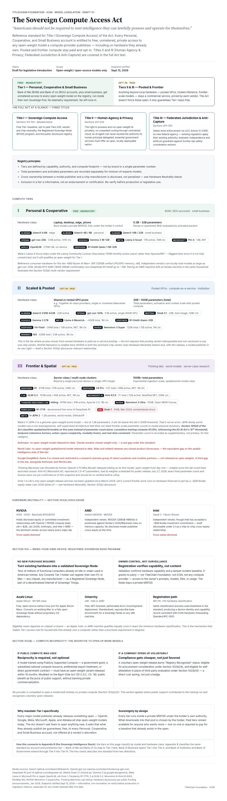

<!-- SPDX-License-Identifier: CC-BY-4.0 -->

# Sovereign Compute Access Act

**Draft v1 - published September 13, 2026, for public review and comment.**

> Americans should not be required to rent intelligence they can lawfully
> possess and operate for themselves.

The Sovereign Compute Access Act is model legislation proposing free, private,
unmetered access to open-weight artificial intelligence for individuals,
cooperatives, and small businesses, including local execution on hardware they
already own. It also proposes human-rooted limits on agent authority,
state-primary administration, vendor neutrality, public disclosures, and
anti-capture safeguards.

This is a public-review draft. It has not been enacted, introduced by a
legislative office, or reviewed as the final work product of legislative
counsel. It is not an adopted ICSN standard.

## Featured visual: Open-Weight Compute Reference

	

Appendix A is a non-normative visual reference for reviewing the proposal's
personal, pooled, and frontier compute tiers; open-weight model access;
hardware capability; registered sovereign nodes; public-support reciprocity;
and vendor-neutral disclosure requirements. Its classifications remain open
to legal, technical, economic, security, accessibility, and implementation
review.

**[View the rendered reference](https://titlechain-foundation.github.io/icsn-standards/sovereign-compute-review/visuals/open-weight-compute-reference.html) · [View or download the full-resolution PNG](appendices/OPEN-WEIGHT-COMPUTE-REFERENCE.png) · [Open the live review observatory](https://titlechain-foundation.github.io/icsn-standards/sovereign-compute-review/) · [Submit a public comment](https://github.com/orgs/TitleChain-Foundation/discussions/38)**

## Draft v1 documents

- [Official model-act text](OFFICIAL-TEXT.md)
- [Legislative transmittal sheet](COVER-SHEET.md)
- [Founder and repository addendum](ADDENDUM.md)
- [M5 AI Governor Commons companion](M5-AI-GOVERNOR-COMMONS-COMPANION.md)
- Appendix A - Open-Weight Compute Reference:
	[rendered visual](https://titlechain-foundation.github.io/icsn-standards/sovereign-compute-review/visuals/open-weight-compute-reference.html) |
	[HTML source](appendices/OPEN-WEIGHT-COMPUTE-REFERENCE.html) |
	[full-resolution PNG](appendices/OPEN-WEIGHT-COMPUTE-REFERENCE.png)
- Appendix B - Sovereign Intelligence Stack:
	[rendered visual](https://titlechain-foundation.github.io/icsn-standards/sovereign-compute-review/visuals/sovereign-intelligence-stack.html) |
	[HTML source](appendices/SOVEREIGN-INTELLIGENCE-STACK.html)
- Public-review media:
	[view the Sovereign Compute Access Act carousel and download all 16 cards](media/sovereign-compute-act-carousel/README.md)

## Public review

Read the [public-review hub](PUBLIC-REVIEW.md) for the review scope, comment
channels, participation boundaries, and response lifecycle. Comments,
corrections, legal analysis, implementation critiques, and legislative-office
inquiries are welcome.

The [live review observatory](https://titlechain-foundation.github.io/icsn-standards/sovereign-compute-review/)
indexes Discussion 38, distinguishes Foundation seed questions from independent
responses, and publishes human-reviewed summary takeaways.

Legislative sponsorship is distinct from financial or project sponsorship of
the Foundation. A legislative office interested in introduction or
co-sponsorship should identify its jurisdiction and the materials it needs.
