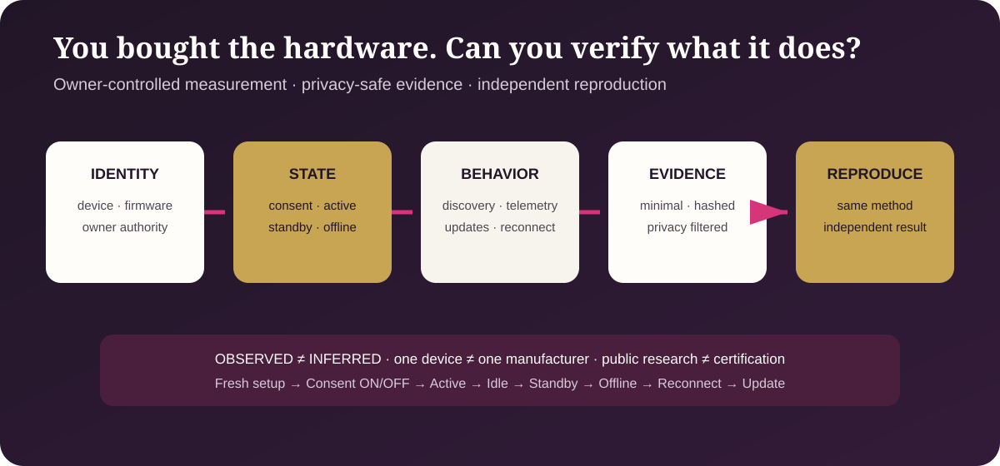

<!-- SPDX-License-Identifier: CC-BY-4.0 -->

# Public Schemas

Schemas make proposed records inspectable and interoperable. Schema validity
proves structure only; it does not prove truth, authority, legal status,
security, certification, or deployment.

## Hardware endpoint trust

| Schema | Record |
| --- | --- |
| [Hardware endpoint observation](hardware-endpoint-observation.schema.json) | One privacy-preserving behavior observation or attributed statement |
| [Hardware endpoint test run](hardware-endpoint-test-run.schema.json) | One authorized run across declared device states |
| [Hardware endpoint capture score](hardware-endpoint-capture-score.schema.json) | Draft evidence exchange for a separately governed Economic Capture Eval scenario |

See [synthetic examples](../examples/README.md) and the
[validation tool](../tests/validate_hardware_endpoint_package.py).

## Existing public schemas

The remaining JSON files in this directory support title, authority,
capability, custody, and role records. Their individual `$id`, version, and
linked documentation control.
